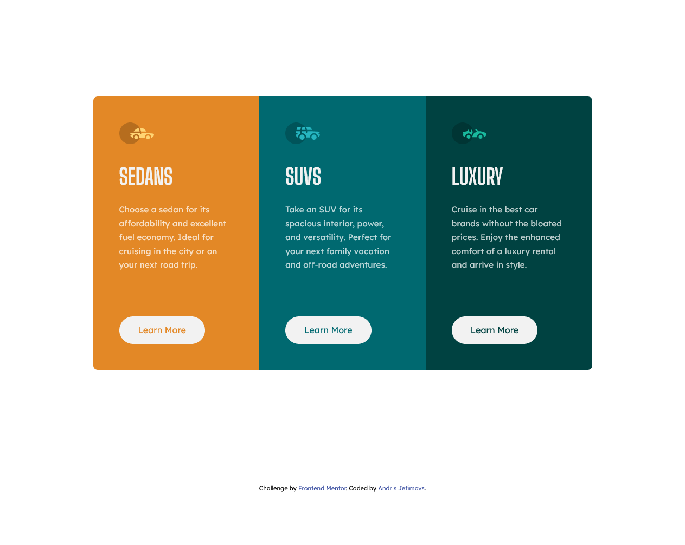

# Frontend Mentor - 3-column preview card component solution

This is a solution to the [3-column preview card component challenge on Frontend Mentor](https://www.frontendmentor.io/challenges/3column-preview-card-component-pH92eAR2-). Frontend Mentor challenges help you improve your coding skills by building realistic projects.

## Table of contents

- [Frontend Mentor - 3-column preview card component solution](#frontend-mentor---3-column-preview-card-component-solution)
  - [Table of contents](#table-of-contents)
  - [Overview](#overview)
    - [The challenge](#the-challenge)
    - [Screenshot](#screenshot)
    - [Links](#links)
  - [My process](#my-process)
    - [Built with](#built-with)
    - [What I learned](#what-i-learned)
    - [Useful resources](#useful-resources)
  - [Author](#author)

## Overview

### The challenge

Users should be able to:

- View the optimal layout depending on their device's screen size
- See hover states for interactive elements

### Screenshot



### Links

- Live Site URL: [GitHub Pages](https://andrisjefimovs.github.io/frontendmentor-3-column-preview-card)

## My process

1. Create a rough HTML structure using `div` elements
2. Use semantic HTML tags where needed
3. Create styling for desktop
4. Make media query for mobile devices

### Built with

- Semantic HTML5 markup
- CSS custom properties
- Flexbox
- CSS Grid (centering)
- Desktop-first workflow

### What I learned

To see how you can add code snippets, see below:

```css
selector {
  width: min(50vw, 50%);
}
```
Uses the smaller value
```css
selector {
  width: max(50vw, 50%);
}
```
Uses the greater value
```css
selector {
  width: clamp(50px, 50%, 100px);
}
```
Uses the smaller value if 50% is less than 50px, uses the greater value if 50% is greater than 100px.

### Useful resources

- [min(), max(), and clamp(): three logical CSS functions to use today](https://web.dev/min-max-clamp/) - This website includes some great animations of the CSS min(), max() and clamp() functions.

## Author

- Frontend Mentor - [@AndrisJefimovs](https://www.frontendmentor.io/profile/AndrisJefimovs)
